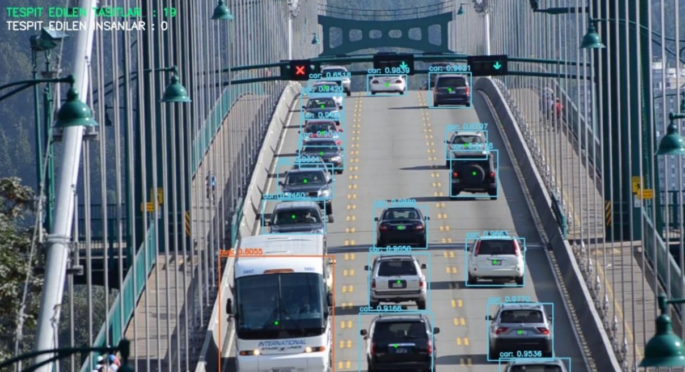

<!--
*** Semih Aydın 2023
-->

Real-time object detection

# Yolo V3 Panel
You need to download the [YOLOV3 weight](https://pjreddie.com/darknet/yolo/) file for the application. You must save the weight file to the YOLO\yolo-coco path.

## In-App Images

## Made With
*   C#
*   Python

## Contributing
Pull requests are welcome. For major changes, please open an issue first to discuss what you would like to change.

## Contact
For any problems, you can contact me at the addresses below.
*   Discord: PHOENIX#7103
*   E-Mail: semihaydn034@gmail.com

## License
[MIT](https://choosealicense.com/licenses/mit/)

